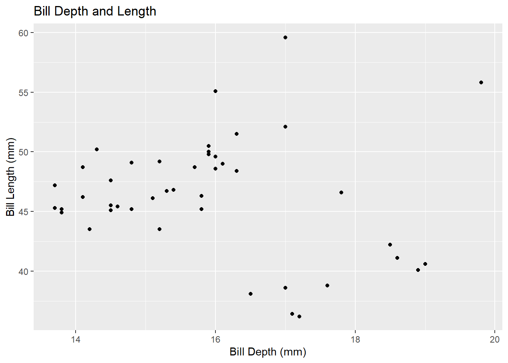
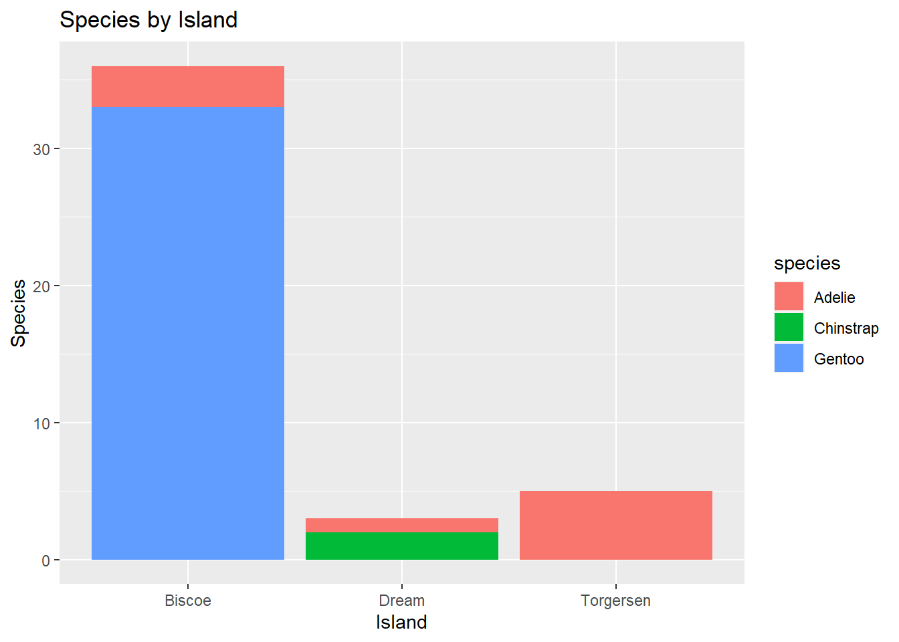
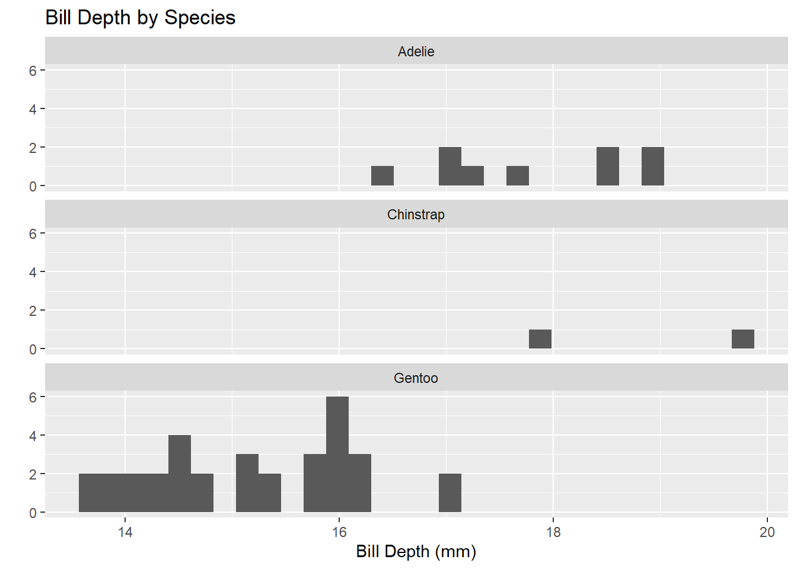
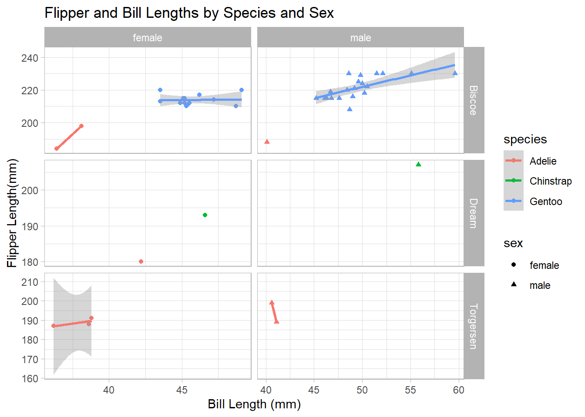

## Palmer Penguin Analysis

This an analysis of the Palmer's Penguins Data Set

## Loading Packages & Datasets

Here we will load the tidyverse package and penguins data.


::: {.cell}

```{.r .cell-code}
library(tidyverse)
```

::: {.cell-output .cell-output-stderr}
```
── Attaching packages ─────────────────────────────────────── tidyverse 1.3.2 ──
✔ ggplot2 3.4.0      ✔ purrr   1.0.0 
✔ tibble  3.1.8      ✔ dplyr   1.0.10
✔ tidyr   1.2.1      ✔ stringr 1.5.0 
✔ readr   2.1.3      ✔ forcats 0.5.2 
── Conflicts ────────────────────────────────────────── tidyverse_conflicts() ──
✖ dplyr::filter() masks stats::filter()
✖ dplyr::lag()    masks stats::lag()
```
:::

```{.r .cell-code}
#Read the penguins_samp1 data file from github
penguins <- read_csv("https://raw.githubusercontent.com/mcduryea/Intro-to-Bioinformatics/main/data/penguins_samp1.csv")
```

::: {.cell-output .cell-output-stderr}
```
Rows: 44 Columns: 8
── Column specification ────────────────────────────────────────────────────────
Delimiter: ","
chr (3): species, island, sex
dbl (5): bill_length_mm, bill_depth_mm, flipper_length_mm, body_mass_g, year

ℹ Use `spec()` to retrieve the full column specification for this data.
ℹ Specify the column types or set `show_col_types = FALSE` to quiet this message.
```
:::

```{.r .cell-code}
#See the first six rows of the data we've read in to our notebook
penguins %>% head()
```

::: {.cell-output .cell-output-stdout}
```
# A tibble: 6 × 8
  species island bill_length_mm bill_depth_mm flipper_leng…¹ body_…² sex    year
  <chr>   <chr>           <dbl>         <dbl>          <dbl>   <dbl> <chr> <dbl>
1 Gentoo  Biscoe           59.6          17              230    6050 male   2007
2 Gentoo  Biscoe           48.6          16              230    5800 male   2008
3 Gentoo  Biscoe           52.1          17              230    5550 male   2009
4 Gentoo  Biscoe           51.5          16.3            230    5500 male   2009
5 Gentoo  Biscoe           55.1          16              230    5850 male   2009
6 Gentoo  Biscoe           49.8          15.9            229    5950 male   2009
# … with abbreviated variable names ¹​flipper_length_mm, ²​body_mass_g
```
:::
:::


You can add options to executable code like this


::: {.cell}

```{.r .cell-code}
#Load the tidyverse
library(tidyverse)
library(kableExtra)
```

::: {.cell-output .cell-output-stderr}
```

Attaching package: 'kableExtra'
```
:::

::: {.cell-output .cell-output-stderr}
```
The following object is masked from 'package:dplyr':

    group_rows
```
:::

```{.r .cell-code}
#Read the penguins_samp1 data file from github
penguins <- read_csv("https://raw.githubusercontent.com/mcduryea/Intro-to-Bioinformatics/main/data/penguins_samp1.csv")
```

::: {.cell-output .cell-output-stderr}
```
Rows: 44 Columns: 8
```
:::

::: {.cell-output .cell-output-stderr}
```
── Column specification ────────────────────────────────────────────────────────
Delimiter: ","
chr (3): species, island, sex
dbl (5): bill_length_mm, bill_depth_mm, flipper_length_mm, body_mass_g, year

ℹ Use `spec()` to retrieve the full column specification for this data.
ℹ Specify the column types or set `show_col_types = FALSE` to quiet this message.
```
:::

```{.r .cell-code}
#See the first six rows of the data we've read in to our notebook
penguins %>% 
  head(2) %>% 
  kable() %>% 
  kable_styling(c("striped", "hover"))
```

::: {.cell-output-display}

`````{=html}
<table class="table table-striped table-hover" style="margin-left: auto; margin-right: auto;">
 <thead>
  <tr>
   <th style="text-align:left;"> species </th>
   <th style="text-align:left;"> island </th>
   <th style="text-align:right;"> bill_length_mm </th>
   <th style="text-align:right;"> bill_depth_mm </th>
   <th style="text-align:right;"> flipper_length_mm </th>
   <th style="text-align:right;"> body_mass_g </th>
   <th style="text-align:left;"> sex </th>
   <th style="text-align:right;"> year </th>
  </tr>
 </thead>
<tbody>
  <tr>
   <td style="text-align:left;"> Gentoo </td>
   <td style="text-align:left;"> Biscoe </td>
   <td style="text-align:right;"> 59.6 </td>
   <td style="text-align:right;"> 17 </td>
   <td style="text-align:right;"> 230 </td>
   <td style="text-align:right;"> 6050 </td>
   <td style="text-align:left;"> male </td>
   <td style="text-align:right;"> 2007 </td>
  </tr>
  <tr>
   <td style="text-align:left;"> Gentoo </td>
   <td style="text-align:left;"> Biscoe </td>
   <td style="text-align:right;"> 48.6 </td>
   <td style="text-align:right;"> 16 </td>
   <td style="text-align:right;"> 230 </td>
   <td style="text-align:right;"> 5800 </td>
   <td style="text-align:left;"> male </td>
   <td style="text-align:right;"> 2008 </td>
  </tr>
</tbody>
</table>

`````

:::
:::


#### About Our Data

The data we are working with is a data set on penguins, which includes 8 features measured on 44 penguins. The features included are physiological features (like bill length, bill depth,flipper length, body mass, etc) as well as other features like the year that the penguin was observed, the island the penguin was observed on, the sex of the penguin, and the speicies of the penguin.

#### Interesting questions to ask

-   What is the average flipper length for each species?

-   are there more male or female penguins? what about per island or species

-   What is the average body mass? what about by island? By species? by sex?

-   What is the ratio of bill length to bill depth for a penguin? what is the overall average of this metric? Does it change by species, sex, or island

#### Data Manipulation Tools and strategies

We can look at individual columns in a data set or subsets of columns in a data set. For example, if we are only interested in flipper length and species, we can select `select()`


::: {.cell}

```{.r .cell-code}
#we can filter by sex (Categorical Variables)
penguins %>%
  filter(species == "Chinstrap")
```

::: {.cell-output .cell-output-stdout}
```
# A tibble: 2 × 8
  species   island bill_length_mm bill_depth_mm flipper_le…¹ body_…² sex    year
  <chr>     <chr>           <dbl>         <dbl>        <dbl>   <dbl> <chr> <dbl>
1 Chinstrap Dream            55.8          19.8          207    4000 male   2009
2 Chinstrap Dream            46.6          17.8          193    3800 fema…  2007
# … with abbreviated variable names ¹​flipper_length_mm, ²​body_mass_g
```
:::

```{.r .cell-code}
#we can also use filter by numerical variables
penguins %>%
  filter(body_mass_g >= 6000)
```

::: {.cell-output .cell-output-stdout}
```
# A tibble: 2 × 8
  species island bill_length_mm bill_depth_mm flipper_leng…¹ body_…² sex    year
  <chr>   <chr>           <dbl>         <dbl>          <dbl>   <dbl> <chr> <dbl>
1 Gentoo  Biscoe           59.6          17              230    6050 male   2007
2 Gentoo  Biscoe           49.2          15.2            221    6300 male   2007
# … with abbreviated variable names ¹​flipper_length_mm, ²​body_mass_g
```
:::

```{.r .cell-code}
#we can also do both
```
:::


#### Answering Our Questions

Most of our questions involve summarizing data, and perhaps summarizing over groups. We can summarize using the `summarize()` function, and group data using `group_by()`


::: {.cell}

```{.r .cell-code}
#overall average flipper length
penguins %>%
  summarize(avg_flipper_length = mean(flipper_length_mm))
```

::: {.cell-output .cell-output-stdout}
```
# A tibble: 1 × 1
  avg_flipper_length
               <dbl>
1               212.
```
:::

```{.r .cell-code}
#single species average
penguins %>%
  filter(species == "Gentoo") %>%
  summarize(avg_flipper_length = mean(flipper_length_mm))
```

::: {.cell-output .cell-output-stdout}
```
# A tibble: 1 × 1
  avg_flipper_length
               <dbl>
1               218.
```
:::

```{.r .cell-code}
#Grounded Average
penguins %>%
  group_by(species) %>%
  summarize(avg_flipper_length = mean(flipper_length_mm))
```

::: {.cell-output .cell-output-stdout}
```
# A tibble: 3 × 2
  species   avg_flipper_length
  <chr>                  <dbl>
1 Adelie                  189.
2 Chinstrap               200 
3 Gentoo                  218.
```
:::
:::


How many of each species do we have?


::: {.cell}

```{.r .cell-code}
penguins %>%
  count(species)
```

::: {.cell-output .cell-output-stdout}
```
# A tibble: 3 × 2
  species       n
  <chr>     <int>
1 Adelie        9
2 Chinstrap     2
3 Gentoo       33
```
:::
:::


How many of each sex are there? What about by island or by species?


::: {.cell}

```{.r .cell-code}
penguins %>%
  count(sex)
```

::: {.cell-output .cell-output-stdout}
```
# A tibble: 2 × 2
  sex        n
  <chr>  <int>
1 female    20
2 male      24
```
:::
:::


We can use a function called mutate to add new columns to our data set


::: {.cell}

```{.r .cell-code}
penguins_with_ratio <- penguins %>%
  mutate(bill_ltd_ratio = bill_length_mm / bill_depth_mm)

#average ratio
penguins %>%
  mutate(bill_ltd_ratio = bill_length_mm / bill_depth_mm) %>%
  summarize(mean_bill_ltd_ratio = mean(bill_ltd_ratio),
            median_bill_ltd_ratio = median(bill_ltd_ratio))
```

::: {.cell-output .cell-output-stdout}
```
# A tibble: 1 × 2
  mean_bill_ltd_ratio median_bill_ltd_ratio
                <dbl>                 <dbl>
1                2.95                  3.06
```
:::

```{.r .cell-code}
#Average Ratio by Group
penguins %>%
  group_by(species) %>%
  mutate(bill_ltd_ratio = bill_length_mm / bill_depth_mm) %>%
  summarize(mean_bill_ltd_ratio = mean(bill_ltd_ratio),
            median_bill_ltd_ratio = median(bill_ltd_ratio))
```

::: {.cell-output .cell-output-stdout}
```
# A tibble: 3 × 3
  species   mean_bill_ltd_ratio median_bill_ltd_ratio
  <chr>                   <dbl>                 <dbl>
1 Adelie                   2.20                  2.20
2 Chinstrap                2.72                  2.72
3 Gentoo                   3.17                  3.13
```
:::
:::


Average Body Mass By Year


::: {.cell}

```{.r .cell-code}
penguins %>%
  group_by(year) %>%
  summarize(mean_body_mass = mean(body_mass_g))
```

::: {.cell-output .cell-output-stdout}
```
# A tibble: 3 × 2
   year mean_body_mass
  <dbl>          <dbl>
1  2007          5079.
2  2008          4929.
3  2009          4518.
```
:::
:::

::: {.cell}

```{.r .cell-code}
penguins %>%
  count(island)
```

::: {.cell-output .cell-output-stdout}
```
# A tibble: 3 × 2
  island        n
  <chr>     <int>
1 Biscoe       36
2 Dream         3
3 Torgersen     5
```
:::
:::

::: {.cell}

```{.r .cell-code}
penguins %>%
  count(island, species) %>%
  pivot_wider(names_from = species, values_from = n, values_fill = 0)
```

::: {.cell-output .cell-output-stdout}
```
# A tibble: 3 × 4
  island    Adelie Gentoo Chinstrap
  <chr>      <int>  <int>     <int>
1 Biscoe         3     33         0
2 Dream          1      0         2
3 Torgersen      5      0         0
```
:::
:::

::: {.cell}

```{.r .cell-code}
penguins %>%
  count(island, species) %>%
  pivot_wider(names_from = species, values_from = n, values_fill = 0) %>%
  kable() %>%
  kable_styling(bootstrap_options = c("hover", "striped"))
```

::: {.cell-output-display}

`````{=html}
<table class="table table-hover table-striped" style="margin-left: auto; margin-right: auto;">
 <thead>
  <tr>
   <th style="text-align:left;"> island </th>
   <th style="text-align:right;"> Adelie </th>
   <th style="text-align:right;"> Gentoo </th>
   <th style="text-align:right;"> Chinstrap </th>
  </tr>
 </thead>
<tbody>
  <tr>
   <td style="text-align:left;"> Biscoe </td>
   <td style="text-align:right;"> 3 </td>
   <td style="text-align:right;"> 33 </td>
   <td style="text-align:right;"> 0 </td>
  </tr>
  <tr>
   <td style="text-align:left;"> Dream </td>
   <td style="text-align:right;"> 1 </td>
   <td style="text-align:right;"> 0 </td>
   <td style="text-align:right;"> 2 </td>
  </tr>
  <tr>
   <td style="text-align:left;"> Torgersen </td>
   <td style="text-align:right;"> 5 </td>
   <td style="text-align:right;"> 0 </td>
   <td style="text-align:right;"> 0 </td>
  </tr>
</tbody>
</table>

`````

:::
:::

::: {.cell}

```{.r .cell-code}
penguins %>%
  summarize(mean_bill_length_mm = mean(bill_length_mm))
```

::: {.cell-output .cell-output-stdout}
```
# A tibble: 1 × 1
  mean_bill_length_mm
                <dbl>
1                46.4
```
:::
:::

::: {.cell}

```{.r .cell-code}
penguins %>%
  summarize(mean_bill_length_mm = mean(bill_length_mm, na.rm = TRUE))
```

::: {.cell-output .cell-output-stdout}
```
# A tibble: 1 × 1
  mean_bill_length_mm
                <dbl>
1                46.4
```
:::
:::

::: {.cell}

```{.r .cell-code}
penguins %>%
  summarize(
    min_bill_length = min(bill_length_mm, na.rm = TRUE),
    first_quartile_bill_length = quantile(bill_length_mm, 0.25, na.rm = TRUE),
    median_bill_length = median(bill_length_mm, na.rm = TRUE),
    mean_bill_length_mm = mean(bill_length_mm, na.rm = TRUE),
    third_quartile_bill_length = quantile(bill_length_mm, 0.75, na.rm = TRUE),
    standard_deviation_bill_length = sd(bill_length_mm, na.rm = TRUE)
    ) %>%
  pivot_longer(cols = everything())
```

::: {.cell-output .cell-output-stdout}
```
# A tibble: 6 × 2
  name                           value
  <chr>                          <dbl>
1 min_bill_length                36.2 
2 first_quartile_bill_length     44.6 
3 median_bill_length             46.4 
4 mean_bill_length_mm            46.4 
5 third_quartile_bill_length     49.1 
6 standard_deviation_bill_length  4.93
```
:::
:::

::: {.cell}

```{.r .cell-code}
penguins %>%
  select(species, island, sex, year)
```

::: {.cell-output .cell-output-stdout}
```
# A tibble: 44 × 4
   species island sex    year
   <chr>   <chr>  <chr> <dbl>
 1 Gentoo  Biscoe male   2007
 2 Gentoo  Biscoe male   2008
 3 Gentoo  Biscoe male   2009
 4 Gentoo  Biscoe male   2009
 5 Gentoo  Biscoe male   2009
 6 Gentoo  Biscoe male   2009
 7 Gentoo  Biscoe male   2008
 8 Gentoo  Biscoe male   2009
 9 Gentoo  Biscoe male   2008
10 Gentoo  Biscoe male   2007
# … with 34 more rows
```
:::
:::

::: {.cell}

```{.r .cell-code}
penguins %>%
  select(species, island, sex, year) %>%
  filter(species == "Chinstrap")
```

::: {.cell-output .cell-output-stdout}
```
# A tibble: 2 × 4
  species   island sex     year
  <chr>     <chr>  <chr>  <dbl>
1 Chinstrap Dream  male    2009
2 Chinstrap Dream  female  2007
```
:::
:::

::: {.cell}

```{.r .cell-code}
chinstraps <- penguins %>%
  select(species, island, sex, year) %>%
  filter(species == "Chinstrap") %>%
  select(-species)

chinstraps %>%
  head()
```

::: {.cell-output .cell-output-stdout}
```
# A tibble: 2 × 3
  island sex     year
  <chr>  <chr>  <dbl>
1 Dream  male    2009
2 Dream  female  2007
```
:::
:::

::: {.cell}

```{.r .cell-code}
penguins %>%
  group_by(species) %>%
  summarise(
    mean_bill_depth_mm = mean(bill_depth_mm, na.rm = TRUE),
    sd_bill_depth_mm = sd(bill_depth_mm, na.rm = TRUE)
  )
```

::: {.cell-output .cell-output-stdout}
```
# A tibble: 3 × 3
  species   mean_bill_depth_mm sd_bill_depth_mm
  <chr>                  <dbl>            <dbl>
1 Adelie                  17.8            0.935
2 Chinstrap               18.8            1.41 
3 Gentoo                  15.2            0.951
```
:::
:::

::: {.cell}

```{.r .cell-code}
penguins %>%
  ggplot() +
  geom_bar(mapping = aes(x = species)) +
  labs(title ="Counts of Penguin Species",
       x = "Species", y = "Count")
```

::: {.cell-output-display}
{width=672}
:::
:::


The data above displays the relationship between the three species of penguin (Adelie, Chinstrap, and Gentoo) and the count. The data shows that there is a large amount of the Gentoo population, and smaller amount of the Adelie population, and a minimal amount of the Chinstrap population.


::: {.cell}

```{.r .cell-code}
penguins %>%
  ggplot() +
  geom_histogram(mapping = aes(x = bill_length_mm),
                 color = "white",
                 fill = "blue") +
  labs(title ="Distribution of Bill Lengths",
       x = "Bill Length (mm)", y = "Count")
```

::: {.cell-output .cell-output-stderr}
```
`stat_bin()` using `bins = 30`. Pick better value with `binwidth`.
```
:::

::: {.cell-output-display}
{width=672}
:::
:::


The graph displayed here shows the distribution of bill lengths, and how many penguins share similar bill length. This data includes the bill lengths of all three penguin species. The distribution type appears to be normal, with outliers on each end of the distribution. The focal point of this data set is the bill lengths within the 45mm to 50mm range. A majority of penguins seem to have mid length beaks, primaraly in the 45mm to 46mm range.


::: {.cell}

```{.r .cell-code}
penguins %>%
  ggplot() +
  geom_point(mapping = aes(x = bill_depth_mm, y = bill_length_mm)) +
  labs(title = "Bill Depth and Length",
       x = "Bill Depth (mm)",
       y = "Bill Length (mm)")
```

::: {.cell-output-display}
{width=672}
:::
:::


In this graph, the bill depth is measured against the bill length. The data appears to show a slight correlation between shorter bill depths and longer bill lengths. Most of the plots lie in the bill ldepth range of 14mm to 16mm and a bill length of 45mm to 50mm. In the middle and left quadrants of the graph, bill lengths appear to be shorter on average while the bill depth is larger, aside from a handful of stand out outliers between the bill depth range of 16mm to 18mm.


::: {.cell}

```{.r .cell-code}
penguins %>%
  ggplot() +
  geom_bar(mapping = aes(x = island, fill = species)) +
  labs(title = "Species by Island",
       x = "Island",
       y = "Species")
```

::: {.cell-output-display}
{width=672}
:::
:::


The data set above depicts the relationship between the species of penguin and the islands observed. The Gentoo only appear to populate the Biscoe island. The Gentoo penguins dominate the population on this island, however they do share is with a small portion of Adelie penguins. Dream island is populated primarily by Chinstrap penguins, and the Chinstrap penguins share this island with a very small proportion of Adelie penguins. Finally, Torgersen island is populated only by Adelie penguins. From the gathered data, we can make an observation that the Adelie penguins seem to move around, and take refuge on multiple different islands. The Gentoo penguins have the largest population, and are all located on one island.


::: {.cell}

```{.r .cell-code}
penguins %>%
  ggplot() +
  geom_boxplot(mapping = aes(x = bill_depth_mm, y = species)) +
  labs(title = "Bill Depth by Species",
       x = "Bill Depth (mm)",
       y = "")
```

::: {.cell-output-display}
{width=672}
:::
:::


The bill depth in relation to species show us a good amount of information. Gentoo penguins have a mid sized distribution, with a low of roughly 14.5mm and a high of roughly 15.9mm. The Gentoo penguins have a lower overall bill depth compared to the other species. The Adelie penguins have a sizable distribution between roughly 17.2mm and 18.6mm. Adelie penguins share some similarities with the bill depth of chinstrap penguins, but not an awful lot. This small bit of information could tell us more about the similarities in environments. We know that Adelie and Chinstrap penguins share an island, and that Adelie penguins appear to populate every island observed. Finally, the Chinstrap penguins have the smallest distribution of bill depth. There appears to be a low bill depth of roughly 18.3mm, and a high bill depth of 19.2mm. Chinstrap penguins appear to have the highest overall bill depth by species.


::: {.cell}

```{.r .cell-code}
penguins %>%
  ggplot() +
  geom_histogram(mapping = aes(x = bill_depth_mm)) +
  facet_wrap(~species, ncol = 1) +
  labs(title = "Bill Depth by Species",
       x = "Bill Depth (mm)",
       y = "")
```

::: {.cell-output .cell-output-stderr}
```
`stat_bin()` using `bins = 30`. Pick better value with `binwidth`.
```
:::

::: {.cell-output-display}
{width=672}
:::
:::


Once again, this graph is showing a depiction of bill length in relation to species. This graph gives a different view of the data, and help us support our previous conclusions, or make new ones. Starting with the Adelie penguins, we can see the specifics of the bill depth distribution. We can see more scattered values. The diverse values could be attributed too the Adelies population of all three observed islands. The chinstrap penguins have a much more refined distribution. There are only two specific plots around the 18mm mark and the 19.9mm mark. The data could appear like this due to the smaller population of observed Chinstrap penguins, or could be another factor such as the age or sex of the penguin. Finally we can observe the Gentoo penguins. Gentoo penguins have the largest distribution here. This could be due to the large population of the observed Gentoo penguins.


::: {.cell}

```{.r .cell-code}
penguins %>%
  filter(!is.na(sex)) %>%
  ggplot() +
  geom_point(mapping = aes(x = bill_length_mm, 
                           y = flipper_length_mm,
                           color = species,
                           shape = sex)) +
  geom_smooth(mapping = aes(x = bill_length_mm,
                            y = flipper_length_mm,
                            color = species),
              method = "lm") +
  facet_grid(island ~ sex, scales = "free") +
  labs(title = "Flipper and Bill Lengths by Species and Sex",
       x = "Bill Length (mm)",
       y = "Flipper Length(mm)") +
  theme_light()
```

::: {.cell-output .cell-output-stderr}
```
`geom_smooth()` using formula = 'y ~ x'
```
:::

::: {.cell-output .cell-output-stderr}
```
Warning in qt((1 - level)/2, df): NaNs produced

Warning in qt((1 - level)/2, df): NaNs produced
```
:::

::: {.cell-output .cell-output-stderr}
```
Warning in max(ids, na.rm = TRUE): no non-missing arguments to max; returning
-Inf

Warning in max(ids, na.rm = TRUE): no non-missing arguments to max; returning
-Inf
```
:::

::: {.cell-output-display}
{width=672}
:::
:::


This graph shows the relationship of flipper and bill length by the species and sex. This data set gives us alot of information regarding the species by gender, and the island the penguins reside on. The male and female flipper and bill length are very similar for the Adelie penguins on Biscoe island. The male and female Gentoo penguins have a similar distribution when addressing flipper and bill length, however there is a larger population of males, and most of them have a larger flipper length despite having a similar bill length. Even though both the Adelie and Gentoo penguins share an island, the bill and flipper lengths are very different. On Dream island, the Male and female penguins have very different results on flipper and bill length. The female penguins have a shorter bill length and flipper length, while the males have a much higher flipper and bill length. The Adelie penguins residing on Dream island have a similar flipper length to their Biscoe island counterparts, however their bill length is much longer. The female Adelie penguins on Torgersen island have an average or middle ground flipper length, unlike the Adelie penguins on Biscoe island, which have a lower flipper length. Both groups of Adelie penguins share a similar bill length. The male Adelie penguins on Torgersen island have a very different distribution to the male penguins on Biscoe island. The males on Torgersen island have a much larger flipper length, but the bill length are similar for both groups. Despite being spread among multiple islands, the Adelie penguins have a very different flipper lengths among all groups, but the bill depth is relatively similar. This could be the cause of different environments, and adaption.
